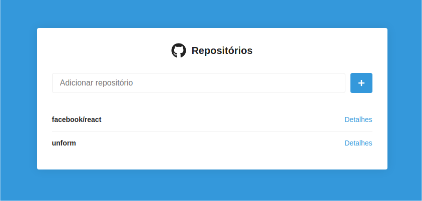

<h1 align="center">Desafio 05: Primeiro projeto com ReactJS</h1>

  
  

## Sobre

Essa aplicaçã faz partes dos desafios do bootcamp da Rocketseat.

É uma aplicação simples, onde se pode buscar por repositórios no Github inserindo `nome-dono-repositório/nome-repositório`.

Clicando em detalhes é possível visualizar todas as issues ou você pode opitar por filtrar e listar a penas as issues com status `open` ou `closed`

Clicando com o botão direito no nome da issue é possivel visualizar a página específica da issue em uma aba do Browser.
